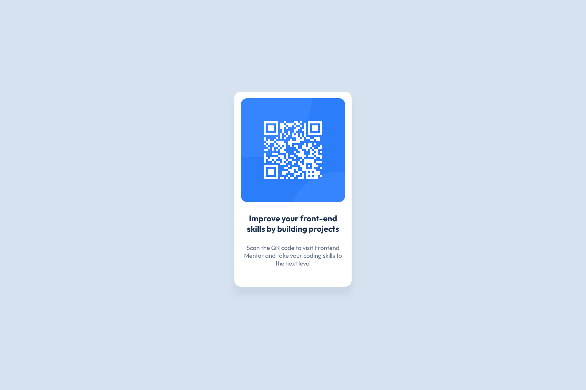

# Frontend Mentor - QR code component solution

This is a solution to the [QR code component challenge on Frontend Mentor](https://www.frontendmentor.io/challenges/qr-code-component-iux_sIO_H). Frontend Mentor challenges help you improve your coding skills by building realistic projects.

## Table of contents

- [Overview](#overview)
  - [Screenshot](#screenshot)
  - [Links](#links)
- [My process](#my-process)
  - [Built with](#built-with)
  - [What I learned](#what-i-learned)
  - [Continued development](#continued-development)
  - [Useful resources](#useful-resources)
  - [AI Collaboration](#ai-collaboration)
- [Author](#author)

## Overview

This is a brief recap of how I came up with a solution for the QR code component challenge on Frontend Mentor.

### Screenshot

  

Both screenshots were taken using FireFox screenshot.

### Links

- Solution URL: [https://github.com/OxeeCleen/My-First-FM-Challenge](https://github.com/OxeeCleen/My-First-FM-Challenge)
- Live Site URL: [https://oxeecleen.github.io/My-First-FM-Challenge/](https://oxeecleen.github.io/My-First-FM-Challenge/)

## My process

- Downloaded the required resources  
- Reviewed the material  
- Used the design desktop/mobile images as a visual reference  

### Built with

- Visual Studio Code  
- Google Fonts  
- Custom CSS Properties  
- Windows Snipping Tool (for solution screenshots)

### What I learned

- It's okay to figure things out on your own.  
- Without `height:` there is no vertical centering.  
- Edge and Firefox can be very different in product results.  

### Continued development

- I would like to learn more about upsizing responsive development.

### Useful resources

- [W3Schools](https://www.w3schools.com) — Great resource for many development languages. For this project, I looked up HSL since I normally use RGB and box-shadow.

### AI Collaboration

- I used MS Copilot to help with Figma (download, install, how to open files, close files).

## Author

- Frontend Mentor — [@AliasUsed](https://www.frontendmentor.io/profile/OxeeCleen)
